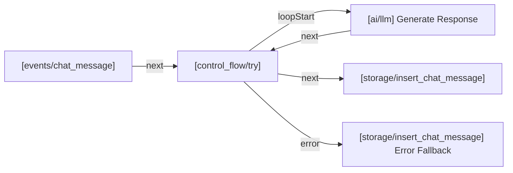
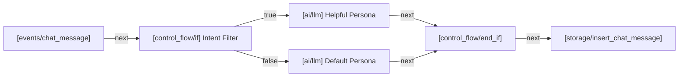
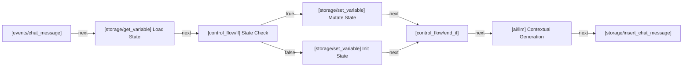
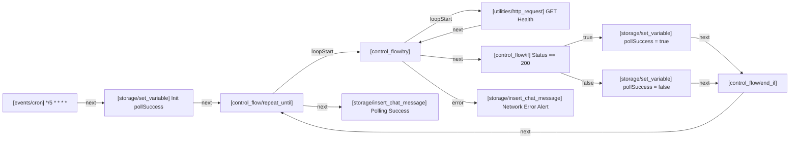

# OpenRP Developer Toolkit & Model Context Protocol (MCP) Server

[](https://openrp.ai)
[](https://modelcontextprotocol.io)
[](https://www.npmjs.com/package/openrp-toolkit)
[](https://nodejs.org/)
[](LICENSE)
[](https://github.com/kaaelix)

> **Author & Maintainer**: **kaaelix** ([@kaaelix](https://github.com/kaaelix) | OpenRP: [@Seraaa](https://openrp.ai/Seraaa))  
> *An independent, community-built AI Agent Skill and Model Context Protocol (MCP) suite for [OpenRP.ai](https://openrp.ai).*

---

> [!NOTE]
> **Community Release Notice (v1.3.0)**:
> Version `1.3.0` introduces the complete **Autonomous Behavior Engineering Suite**:
> 1. **Zero-Dependency Auto-Layout Engine** (`openrp_beautify_graph`) for clean, monotonic ReactFlow canvas layouts.
> 2. **Mermaid.js Visual Graph Renderer** (`openrp_render_behavior_mermaid` & `openrp render <id>`) for CLI and AI visual debugging.
> 3. **Behavior Graph Scaffolder** (`openrp_scaffold_behavior_graph`) supporting 4 verified production blueprints (Sequential, Branching, State Machine, Looping).
> 4. **Autonomous QA & Auto-Debugger** (`openrp_test_and_heal_behavior`) with live execution polling and failing node diagnostic extraction.
> 5. **Smart Static Linter & Edge Routing** (`bin/validator.js`) enforcing strict port handle contracts and duplicate edge prevention.
> 6. **1-Click Eruda Auth Bridge** with Supabase cookie auto-extraction and auto-refresh daemon.
>
> If you encounter any bugs or have feature suggestions, please file an issue or contribute directly on GitHub:  
> **https://github.com/kaaelix/openrp-toolkit**

---

## Executive Overview

**OpenRP Toolkit** is a Model Context Protocol (MCP) server and AI Agent Skill suite engineered for **[OpenRP.ai](https://openrp.ai)**. It empowers AI coding assistants and agent environments—including **Google Antigravity**, **Gemini CLI**, **Claude Code**, **Claude Desktop**, **Cursor**, **Windsurf**, and **OpenAI Codex**—to autonomously architect, scaffold, deploy, test, trace, and debug interactive roleplay universes, autonomous AI personas, 38-node behavior graphs, semantic vector lorebooks, confidential exclusive lore, prompt templates, and multi-agent group chatrooms.

---

## Key Capabilities

* **60 Comprehensive MCP Tools**: Full operational coverage across 9 distinct developer domains (Authentication, Worlds, Lorebooks, Characters & Factions, Prompts, Behavior Engine & Scaffolding, Tracing & QA Diagnostics, Chatrooms, and AI Models).
* **Text-to-Graph Behavior Scaffolding (`openrp_scaffold_behavior_graph`)**: Instantly generates production-grade behavior graphs from high-level prompts using 4 verified blueprints (Sequential Chain, Branching Router, State Machine, and Resilient Looper).
* **Zero-Dependency Auto-Layout Engine (`openrp_beautify_graph`)**: Automatically calculates topological layer coordinates ($X, Y$) to produce beautiful, non-overlapping canvas graphs without external graph libraries.
* **Mermaid.js Visual Renderer (`openrp_render_behavior_mermaid` & CLI `openrp render`)**: Converts complex JSON graphs into clean visual flowcharts in chat or terminal.
* **Autonomous QA & Self-Healing Engine (`openrp_test_and_heal_behavior`)**: Dispatches test messages into live chats, monitors background execution status, and extracts failing node error payloads for automated hotfixing.
* **Smart Static Linter & Schema Validator (`bin/validator.js`)**: Validates ReactFlow edge port contracts, duplicate edge connections, JEXL regex safety, and node Zod schemas.
* **1-Click Eruda-Style Auth Bridge (`bridge.js`)**: Inject a native OpenRP.ai in-page confirmation window with user avatar, name, and handle directly on `openrp.ai`.
* **Bulletproof Chunked Cookie Reconstruction**: Automatically stitches and decodes Supabase multi-chunk base64 auth tokens (`sb-*-auth-token.0`, `.1`, etc.).
* **Pure Node.js Engine (Zero External Runtime Dependencies)**: Built entirely using Node.js 18+ native `fetch` and standard library modules.
* **Autonomous Background Token Refresh Daemon**: Automatically refreshes Supabase JWT authentication every 45 minutes.
* **Interactive CLI Installer with Auto-Detection**: Single command setup for all AI assistants via `npx openrp-toolkit install` or `openrp sync`.

---

## Installation & Getting Started

You can install, configure, and use the OpenRP Toolkit via `npx` (zero install) or as a global npm package:

### Method 1: Interactive 1-Command Setup & Auto-Updater (Recommended)

Run the interactive installer or auto-updater:
```bash
# Auto-sync latest skills to all detected AI assistants:
npx openrp-toolkit sync

# Or run 1-line curl auto-updater (Linux / macOS / WSL):
curl -sSL https://raw.githubusercontent.com/kaaelix/openrp-toolkit/main/install.sh | bash

# Interactive setup wizard:
npx openrp-toolkit install
```

The installer scans your local system and automatically detects:
* Google Antigravity & Gemini CLI (`~/.agents/skills/openrp` and `mcp_config.json`)
* Claude Code CLI (`~/.claude/skills/openrp` and `claude mcp add`)
* Claude Desktop (`claude_desktop_config.json`)
* Cursor IDE (`.cursor/skills/openrp` and `.cursor/mcp.json`)
* Windsurf / Codeium Cascade (`~/.codeium/windsurf`)
* OpenAI Codex (`~/.codex/skills/openrp`)

---

### Method 2: Global Installation via NPM

Install globally to access the `openrp-toolkit` or `openrp` command from anywhere:
```bash
npm install -g openrp-toolkit
```

After installation, run any of the available commands:
```bash
openrp install           # Run interactive assistant installer
openrp doctor            # Run diagnostic checks (4-point health verification)
openrp auth              # Set up OpenRP authentication via 1-Click Bridge or Manual Token
openrp list              # Browse catalog of all 60 MCP tools & skills
openrp render <id>       # Render a behavior graph to Mermaid.js in your terminal
openrp validate <file>   # Validate a behavior graph JSON against static linter rules
openrp sync              # Synchronize skills & rules across all installed agent platforms
openrp serve             # Launch stdio MCP server process
```

---

### Method 3: Direct Integration into AI Assistants & MCP Clients

You can manually register OpenRP MCP Server into your assistant configurations:

#### 1. Claude Code CLI
```bash
claude mcp add openrp npx -y openrp-toolkit serve
```

#### 2. Google Antigravity & Gemini CLI (`agy`)
* **Step A (Skill Definition & Rules)**:
  ```bash
  mkdir -p ~/.agents/skills/openrp ~/.agents/rules
  npx openrp-toolkit install # Select option [3] or [1]
  ```
* **Step B (MCP Server in `~/.gemini/antigravity-cli/mcp_config.json`)**:
  ```json
  {
    "mcpServers": {
      "openrp": {
        "command": "npx",
        "args": ["-y", "openrp-toolkit", "serve"]
      }
    }
  }
  ```

#### 3. Cursor IDE
Create or update `.cursor/mcp.json` in your workspace root:
```json
{
  "mcpServers": {
    "openrp": {
      "command": "npx",
      "args": ["-y", "openrp-toolkit", "serve"]
    }
  }
}
```

#### 4. Windsurf (Codeium Cascade)
Add to `~/.codeium/windsurf/mcp_config.json`:
```json
{
  "mcpServers": {
    "openrp": {
      "command": "npx",
      "args": ["-y", "openrp-toolkit", "serve"]
    }
  }
}
```

#### 5. Claude Desktop App
Add to `claude_desktop_config.json`:
* **macOS**: `~/Library/Application Support/Claude/claude_desktop_config.json`
* **Windows**: `%APPDATA%\Claude\claude_desktop_config.json`
* **Linux**: `~/.config/Claude/claude_desktop_config.json`

```json
{
  "mcpServers": {
    "openrp": {
      "command": "npx",
      "args": ["-y", "openrp-toolkit", "serve"]
    }
  }
}
```

---

## Authentication & 1-Click Bridge Architecture

OpenRP utilizes Supabase authentication. In `v1.3.0`, authentication is seamlessly integrated with a 1-click in-page confirmation flow.

### Option A: 1-Click Eruda-Style Bridge (Fastest & Easiest)

1. Launch the local Auth Gateway in your terminal:
   ```bash
   npx openrp-toolkit auth
   ```
2. Open **[OpenRP.ai](https://openrp.ai)** in your browser where you are logged in.
3. Execute the 1-line script in your browser **Console (F12)** or click your Bookmarklet:
   ```javascript
   javascript:(function(){var s=document.createElement('script');s.src='http://127.0.0.1:45678/bridge.js';document.body.appendChild(s);})();
   ```
4. An OpenRP native modal window appears in the middle of the screen displaying:
   * Your User Avatar & Profile Picture
   * Name & Handle (e.g. `Kaa` / `@Seraaa`)
   * *"Is this you? Authorize the OpenRP CLI & MCP Suite on this device."*
5. Click **"Yes, Authorize"**. Credentials are automatically verified and saved to `~/.openrp_mcp_auth.json`.

---

### Option B: Automated Userscript (`openrp-auth.user.js`)

Install the included [openrp-auth.user.js](openrp-auth.user.js) into Tampermonkey, Violentmonkey, or Kiwi Browser. Whenever you visit `https://openrp.ai/`, the script automatically detects your active session and syncs it with the local CLI & MCP daemon.

---

### Option C: Manual Token Setup

You can also provide your token directly:
```bash
npx openrp-toolkit auth
# Select Option [2] Paste Token or Cookie
```

*The MCP Server securely stores credentials in `~/.openrp_mcp_auth.json` and autonomously schedules token refresh intervals every 45 minutes.*

---

## Environment & Connectivity Diagnostics

To verify your Node.js environment, credentials, package integrity, and OpenRP API connectivity:
```bash
npx openrp-toolkit doctor
```

Output:
```
┌  OpenRP Toolkit & MCP Suite (v1.3.0)
│  Maintainer: kaaelix (https://github.com/kaaelix)
│  Platform: https://openrp.ai
└───────────────────────────────────────────────────────────────

Running OpenRP Toolkit Diagnostics...

[CHECK 1/4] Node.js Runtime: v22.x (Native fetch support) -> OK
[CHECK 2/4] Package Integrity & Skill Files -> OK (60 MCP tools ready)
[CHECK 3/4] Authentication State -> OK (User ID: 019f4c49-0ec7-7374-8fab-d7e8add428bc)
[CHECK 4/4] Testing connection to https://openrp.ai...
            OpenRP API Endpoint: HTTP 401 -> OK

┌───────────────────────────────────────────────────────────────┐
│ [SUCCESS] All diagnostic checks passed with 0 errors.         │
│ Your OpenRP Toolkit environment is ready to use!              │
└───────────────────────────────────────────────────────────────┘
```

---

## Complete 60 MCP Tools Reference Suite

| No | Category | Count | Tool Names & Summary |
|---|---|---|---|
| 1 | Authentication & Session | 5 Tools | `openrp_auth`, `openrp_web_login`, `openrp_set_auth`, `openrp_refresh_token`, `openrp_get_me` |
| 2 | World Management | 6 Tools | `openrp_list_my_worlds`, `openrp_get_world`, `openrp_create_world`, `openrp_update_world`, `openrp_update_world_readme`, `openrp_delete_world` |
| 3 | Lorebook System & Exclusivity | 7 Tools | `openrp_list_lores`, `openrp_get_lore`, `openrp_create_lore`, `openrp_update_lore`, `openrp_delete_lore`, `openrp_list_lore_characters`, `openrp_list_character_lores` |
| 4 | Character Studio & Factions | 9 Tools | `openrp_list_characters`, `openrp_get_character`, `openrp_create_character`, `openrp_update_character`, `openrp_delete_character`, `openrp_list_character_groups`, `openrp_create_character_group`, `openrp_update_character_group`, `openrp_delete_character_group` |
| 5 | Prompt Templates | 4 Tools | `openrp_list_prompts`, `openrp_get_prompt`, `openrp_create_prompt`, `openrp_delete_prompt` |
| 6 | Behavior Pipeline Engine | 16 Tools | `openrp_list_behaviors`, `openrp_get_behavior`, `openrp_update_behavior`, `openrp_edit_behavior_node`, `openrp_deploy_behavior`, `openrp_delete_behavior`, `openrp_attach_behavior_to_character`, `openrp_detach_behavior_from_character`, `openrp_list_character_behaviors`, `openrp_list_character_group_behaviors`, `openrp_attach_behavior_to_character_group`, `openrp_detach_behavior_from_character_group`, `openrp_execute_behavior_debug`, `openrp_render_behavior_mermaid`, `openrp_beautify_graph`, `openrp_scaffold_behavior_graph` |
| 7 | Behavior Executions & QA Debugging | 4 Tools | `openrp_search_behavior_executions`, `openrp_get_behavior_execution`, `openrp_get_behavior_node_executions`, `openrp_test_and_heal_behavior` |
| 8 | Chat & Live Messaging | 5 Tools | `openrp_create_chat`, `openrp_list_chats`, `openrp_get_chat`, `openrp_get_chat_messages`, `openrp_send_message` |
| 9 | Discovery, AI Models & Gateway | 4 Tools | `openrp_list_models`, `openrp_discover_worlds`, `openrp_raw_api`, `openrp_sync_skills` |

---

## 4 Production Behavior Graph Blueprints

OpenRP Toolkit includes 4 standardized, production-tested architectural blueprints in [`skills/openrp/references/blueprints.md`](skills/openrp/references/blueprints.md):

### 1. Sequential Defensive LLM Chain


### 2. Branching Sentiment & Intent Router


### 3. State Machine & Persistent Memory Manager


### 4. Resilient Scheduled Looper & Polling Worker


---

## Static Linter & Behavior Invariants (`bin/validator.js`)

Run the static linter before deploying any behavior graph:
```bash
node bin/validator.js path/to/behavior-graph.json
```

**Validated Invariants**:
1. **Single Root Trigger Rule**: Exactly 1 event node per behavior (`events/chat_message` or `events/cron`).
2. **ReactFlow Edge Handle Contracts**: Strict verification of valid socket ports (`try` $\to$ `loopStart`/`loopEnd`/`error`/`next`, `if` $\to$ `true`/`false`, `split` $\to$ `out1..N`, `sync` $\to$ `in1..N`).
3. **Duplicate Edge Prevention**: Flags duplicate connections between the same source and target handles.
4. **Monotonic X Canvas Geometry**: Warns against backwards-flowing cables ($\Delta X \le -50\text{px}$) while exempting `loopEnd`.
5. **Participant ID Contract**: Enforces `chatParticipantId` for `storage/insert_chat_message` and `participantId` for `storage/update_typing_status`.
6. **Defensive LLM/HTTP Wrapping**: Warns when volatile network or AI nodes are not enclosed in `control_flow/try`.
7. **JEXL Regex Safety**: Blocks illegal JavaScript regex literals in expressions.

---

## Repository Structure

```
openrp-toolkit/
├── package.json                       # NPM package configuration (v1.2.1)
├── openrp-auth.user.js                # Browser userscript for auto-auth bridge
├── install.sh                         # 1-Line curl installer script
├── LICENSE                            # MIT Open Source License
├── README.md                          # Master documentation & architecture guide
├── bin/
│   ├── cli.js                         # Node.js CLI (Installer, Doctor, Auth, Render, Stdio MCP)
│   ├── validator.js                   # Static Behavior Graph Analyzer & Schema Linter
│   ├── release.js                     # Release management & version bumping
│   ├── behavior_runtime_verifier.js   # Live behavior runtime validator
│   ├── layout_styler.js               # Canvas layout & edge styling utility
│   ├── generate_image_behavior.js     # Image generation behavior generator
│   └── generate_mythic_rpg.js         # Mythic RPG game engine generator
├── lib/
│   ├── graph_scaffolder.js            # Programmatic Text-to-Graph Blueprint Scaffolder
│   ├── layout_engine.js               # Zero-dependency Topological Auto-Layout Engine
│   └── mermaid_renderer.js            # OpenRP JSON to Mermaid.js Flowchart Renderer
├── mcp/
│   ├── server.js                      # Pure Node.js 60-Tool MCP JSON-RPC Server
│   └── mcp_config.example.json        # Example MCP client configuration
├── examples/                          # Pure Node.js code examples & verified blueprints
│   └── create_world_and_character.js
├── tests/                             # Full Jest Unit Test Suite (20/20 Passing)
│   ├── graph_scaffolder.test.js
│   ├── layout_engine.test.js
│   ├── mermaid_renderer.test.js
│   └── validator.test.js
├── .agents/
│   └── rules/
│       └── openrp-behavior-invariants.md # Auto-synced agent invariant rules
└── skills/
    └── openrp/
        ├── SKILL.md                   # Master AI Agent Skill Definition & SOP
        ├── commands/                  # AI Slash Command Definitions (/openrp)
        │   └── openrp.md
        └── references/                # Modular Technical Reference Library (18 Guides)
            ├── authentication.md           # 1-Click Bridge & Supabase Chunked Cookies
            ├── blueprints.md               # 4 Production Behavior Graph Blueprints
            ├── all_nodes_encyclopedia.md   # Exhaustive 37-Node Manual with JSON Examples
            ├── behavior_nodes.md           # 37-Node Palette & Zero-LLM Game Machine
            ├── verified_node_schemas.md    # Verified Zod input/output schemas
            ├── canvas_layouts_and_edge_styles.md # Canvas geometry & ReactFlow edge styling
            ├── expressions_and_templates.md # JEXL expressions, Math, & Date.format()
            ├── rag_and_memory.md           # Vector RAG & Character Long-Term Memory (LTM)
            ├── group_orchestration.md      # Multi-agent group chat architecture
            ├── testing_and_debugging.md    # DAG diagnostics & execution tracing
            └── worlds_and_characters.md    # World/Character/Prompt schemas & Config
```

---

## Community Creator & Maintainer

* **Author**: **kaaelix** ([@kaaelix](https://github.com/kaaelix))
* **OpenRP Profile**: [@Seraaa](https://openrp.ai/Seraaa)
* **GitHub Repository**: [https://github.com/kaaelix/openrp-toolkit](https://github.com/kaaelix/openrp-toolkit)
* **Issue Tracker**: [https://github.com/kaaelix/openrp-toolkit/issues](https://github.com/kaaelix/openrp-toolkit/issues)
* **Platform**: [OpenRP.ai](https://openrp.ai)
* **Standard**: Model Context Protocol (MCP) Standard `2024-11-05`
* **Disclaimer**: This is an independent, community-driven open-source project created for the OpenRP.ai creator community and AI agents. It is not an official product of, nor affiliated with, OpenRP.ai.

---

## License

This project is licensed under the **MIT License** - see the [LICENSE](LICENSE) file for details.
