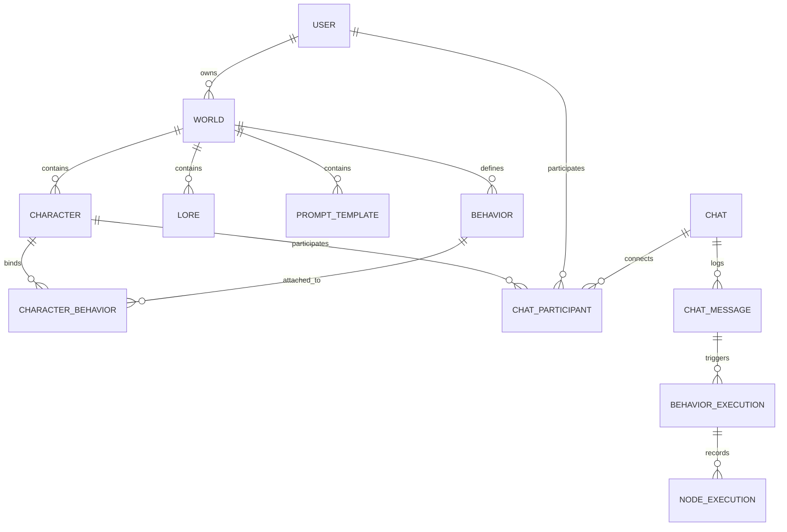

# OpenRP Full Architecture, Schemas & API Specification

Comprehensive architectural blueprint, database models, execution engine lifecycles, and complete REST API specifications for OpenRP.ai.

---

## 1. System Architecture Overview

OpenRP is an autonomous multi-agent simulation and interactive AI platform engineered on top of four decoupled operational layers:

```
+-----------------------------------------------------------------------------------+
|                              OPENRP SYSTEM TOPOLOGY                               |
+-----------------------------------------------------------------------------------+
|  CLIENT & INTEGRATION TIER                                                        |
|  - Web Studio (ReactFlow Canvas, Chat UI, Lorebook Editor, Diagnostics)           |
|  - OpenRP MCP Server (47 high-level tools via JSON-RPC 2.0 stdio)                 |
|  - CLI & REST SDK (Automated deployments, testing pipelines, and cron triggers)   |
+-----------------------------------------------------------------------------------+
|  AUTHENTICATION & IDENTITY TIER                                                   |
|  - Supabase Auth Service (JWT Bearer tokens, refresh token rotation daemon)       |
|  - Multi-tier Permissions (Free Tier vs Plus/Pro Subscriptions)                   |
|  - Resource Ownership Isolation (userId, worldId, characterId)                    |
+-----------------------------------------------------------------------------------+
|  AUTONOMOUS EXECUTION ENGINE                                                      |
|  - Topological Graph Evaluator (Deterministic node dependency resolution)         |
|  - JEXL Expression Parser (Sandboxed variable transformation & conditional gates) |
|  - Parallel Branch Forking & Sync Barriers (`split` -> `sync` with LCA tracking)  |
|  - Viewport Coordinate Virtualization Engine ($X: 100-2400px, $Y: 100-1400px)      |
+-----------------------------------------------------------------------------------+
|  STORAGE, VECTOR & STREAMING TIER                                                 |
|  - PostgreSQL Database (Relational schemas: Worlds, Personas, Lores, Chats)       |
|  - Vector Embeddings Store (pgvector cosine similarity with text-embedding-3)     |
|  - Real-time Message Stream (Server-Sent Events / WebSockets for live typing)     |
+-----------------------------------------------------------------------------------+
```

---

## 2. Database Models & Schema Relationships



### Entity Schemas:

#### 1. World Record (`worlds`)
```typescript
interface World {
  id: string;               // UUID (v7 deterministic)
  owner: string;            // UUID of user creator
  name: string;             // World title
  handle: string;           // URL slug identifier
  description: string;      // Short summary
  readme: string;           // Full Markdown documentation (up to 5000 words)
  visibility: "WORLD_VISIBILITY_PUBLIC" | "WORLD_VISIBILITY_UNLISTED" | "WORLD_VISIBILITY_PRIVATE";
  tags: string[];           // Discovery categories
  chatOnly: boolean;        // If true, disables standalone behavior canvas
  embeddingModelId: string; // Default: "text-embedding-3-small"
  createdAt: string;
  updatedAt: string;
}
```

#### 2. Character Bot Record (`characters`)
```typescript
interface Character {
  id: string;               // UUID
  worldId: string;          // Parent World UUID
  name: string;             // Display name (e.g. "Sera")
  handle: string;           // Mention slug (e.g. "sera-arcade-host")
  status: string;           // Live tagline (e.g. "Online • Ready to play")
  shortDescription: string; // One-line summary
  description: string;      // Detailed biography
  personality: string;      // Persona instructions & behavioral constraints
  greetings: string[];      // Array of greeting strings
  dialogs: Array<{          // Few-shot dialog examples
    user: string;
    character: string;
  }>;
  avatarPath?: string;      // Avatar image storage path
  createdAt: string;
  updatedAt: string;
}
```

#### 3. Lorebook Record (`lores`)
```typescript
interface Lore {
  id: string;               // UUID
  worldId: string;          // Owning World UUID
  title: string;            // Topic header
  handle: string;           // Slug reference
  content: string;          // Raw Markdown factual lore
  isExclusive: boolean;     // If true, hidden from general RAG and character-scoped
  tags: string[];           // Semantic tag filters
  embedding?: number[];     // 1536-dimensional vector embedding
  createdAt: string;
}
```

#### 4. Behavior Graph Record (`behaviors`)
```typescript
interface Behavior {
  id: string;               // UUID
  worldId: string;          // Owning World UUID
  name: string;             // Behavior title
  handle: string;           // Slug
  description: string;      // Workflow explanation
  graph: {
    nodes: Array<{
      id: string;           // Semantic node identifier (e.g. "chatMessage", "llmChat")
      type: string;         // E.g. "events/chat_message", "ai/llm", "storage/insert_chat_message"
      position: { x: number; y: number }; // Canvas layout coordinates
      data: Record<string, any>;          // Configuration inputs, formulas, and expressions
    }>;
    edges: Array<{
      id: string;           // Format: "xy-edge__<src><srcHandle>-<tgt><tgtHandle>"
      source: string;       // Source nodeId
      target: string;       // Target nodeId
      sourceHandle: string; // E.g. "next", "true", "false", "loopStart", "out1"
      targetHandle: string; // E.g. "previous", "loopEnd", "in1", "in2"
    }>;
  };
  createdAt: string;
  updatedAt: string;
}
```

---

## 3. Behavior Execution Engine Lifecycle

When a message is received in an active chatroom, the execution engine completes the following deterministic lifecycle:

```
[Chat Message Sent] 
       │
       ▼
1. Event Trigger (`events/chat_message`)
   - Resolves active `chatId` and `messageId`.
       │
       ▼
2. DAG Topological Sort & Dependency Traversal
   - Evaluates nodes along outgoing `next` edges.
       │
       ▼
3. AST JEXL Expression & Variable Resolution
   - Resolves dynamic expressions (`{ "$expression": "..." }`) against graph state.
   - Evaluates string templates (`{ "$template": "..." }`).
       │
       ▼
4. Context & Vector RAG Injection
   - Queries `storage/get_lores` with semantic query vectors.
   - Queries `storage/get_character_memories`.
       │
       ▼
5. Model Provider Invocation (`ai/llm`)
   - Dispatches prompt to target model provider (Claude, GPT, Gemini, DeepSeek).
       │
       ▼
6. State Mutation & Message Dispatch (`storage/insert_chat_message`)
   - Inserts generated response as the character's chat participant record.
       │
       ▼
7. Execution Log Snapshot Recording
   - Saves resolved node inputs, outputs, timestamps, and error traces.
```

---

## 4. Complete REST API Route Mapping

| Resource Domain | Method | Endpoint Path | Description |
|---|---|---|---|
| **Session** | `GET` | `/api/users/me` | Fetch authenticated account profile & credits |
| **Auth Refresh** | `POST` | `https://uixnaquqjhzcctyfoapf.supabase.co/auth/v1/token` | Refresh Supabase JWT bearer token |
| **Worlds** | `GET` | `/api/users/{userId}/worlds` | List all user-owned worlds |
| **Worlds** | `POST` | `/api/users/{userId}/worlds` | Create new world universe |
| **Worlds** | `GET` | `/api/users/{userId}/worlds/{worldId}` | Retrieve world metadata and stats |
| **Worlds** | `PUT` | `/api/users/{userId}/worlds/{worldId}` | Update world metadata or README documentation |
| **Worlds** | `DELETE` | `/api/users/{userId}/worlds/{worldId}` | Delete world and cascade entities |
| **Lores** | `GET` | `/api/users/{userId}/worlds/{worldId}/lore` | List world lorebook entries |
| **Lores** | `POST` | `/api/users/{userId}/worlds/{worldId}/lore` | Create factual lorebook entry |
| **Lores** | `PUT` | `/api/users/{userId}/worlds/{worldId}/lore/{loreId}` | Update lore title, handle, content |
| **Lores** | `DELETE` | `/api/users/{userId}/worlds/{worldId}/lore/{loreId}` | Delete lorebook entry |
| **Characters** | `GET` | `/api/users/{userId}/worlds/{worldId}/characters` | List characters in world |
| **Characters** | `POST` | `/api/users/{userId}/worlds/{worldId}/characters` | Create new autonomous character persona |
| **Characters** | `PUT` | `/api/users/{userId}/worlds/{worldId}/characters/{characterId}` | Update persona, status, greetings, dialogs |
| **Characters** | `DELETE` | `/api/users/{userId}/worlds/{worldId}/characters/{characterId}` | Delete character from world |
| **Groups** | `GET` | `/api/v1/worlds/{worldId}/character-groups` | List character factions and hierarchies |
| **Groups** | `POST` | `/api/v1/worlds/{worldId}/character-groups` | Create character faction / guild |
| **Groups** | `PATCH` | `/api/v1/character-groups/{groupId}` | Update faction properties |
| **Groups** | `DELETE` | `/api/v1/character-groups/{groupId}` | Delete character faction |
| **Prompts** | `GET` | `/api/users/{userId}/worlds/{worldId}/prompts` | List system prompt templates |
| **Prompts** | `POST` | `/api/users/{userId}/worlds/{worldId}/prompts` | Create prompt template |
| **Prompts** | `DELETE` | `/api/users/{userId}/worlds/{worldId}/prompts/{promptId}` | Delete prompt template |
| **Behaviors** | `GET` | `/api/users/{userId}/worlds/{worldId}/behaviors` | List behavior pipeline graphs |
| **Behaviors** | `POST` | `/api/users/{userId}/worlds/{worldId}/behaviors` | Deploy new behavior graph |
| **Behaviors** | `GET` | `/api/users/{userId}/worlds/{worldId}/behaviors/{behaviorId}` | Retrieve full graph topology (nodes, edges) |
| **Behaviors** | `PUT` | `/api/users/{userId}/worlds/{worldId}/behaviors/{behaviorId}` | In-place topology update |
| **Behaviors** | `PATCH` | `/api/users/{userId}/worlds/{worldId}/behaviors/{behaviorId}/nodes/{nodeId}` | Granular in-place node edit |
| **Behaviors** | `DELETE` | `/api/users/{userId}/worlds/{worldId}/behaviors/{behaviorId}` | Delete behavior pipeline |
| **Bindings** | `POST` | `/api/characters/{characterId}/behaviors` | Bind behavior graph to character |
| **Chats** | `POST` | `/api/chats` | Create 1-on-1 or multi-agent chatroom |
| **Chats** | `GET` | `/api/chats` | List user chat sessions |
| **Chats** | `GET` | `/api/chats/{chatId}` | Get chatroom metadata & participants |
| **Messages** | `GET` | `/api/chats/{chatId}/messages` | Retrieve conversation message history |
| **Messages** | `POST` | `/api/chats/{chatId}/messages` | Insert live message to trigger behaviors |
| **Traces** | `POST` | `/api/v1/behavior-executions/search` | Search behavior execution logs |
| **Traces** | `GET` | `/api/v1/behavior-executions/{executionId}` | Retrieve execution run summary |
| **Traces** | `GET` | `/api/v1/behavior-executions/{executionId}/node-executions` | Retrieve step-by-step resolved node traces |
| **AI Models** | `GET` | `/api/models` | List all 38+ Foundation LLM models |
| **Discover** | `GET` | `/api/worlds/discover` | Search public community worlds |
