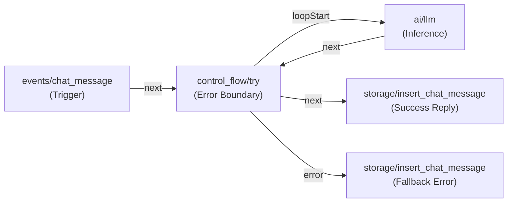
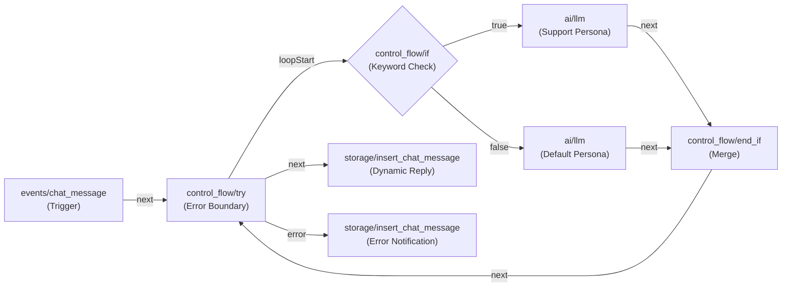
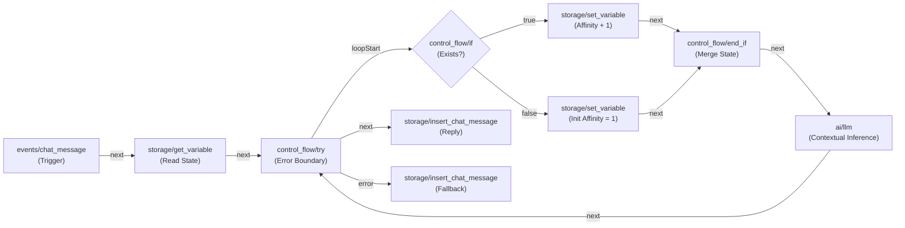
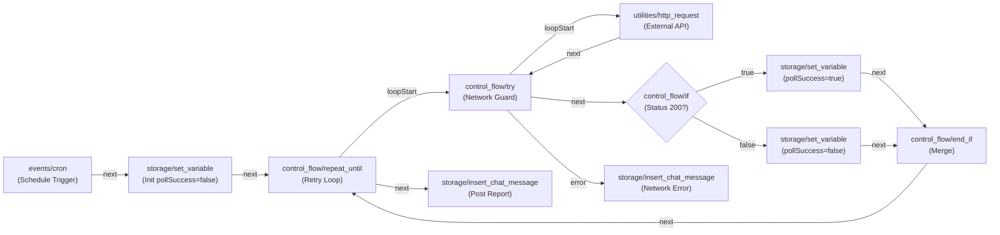

# OpenRP Behavior Graph Production Blueprints

This reference catalog provides **4 production-ready, schema-validated behavior graph blueprints** for the OpenRP runtime engine. Each blueprint strictly follows ReactFlow DAG topologies, exact port handle naming conventions (`xy-edge__...`), monotonic canvas coordinates, and defensive error boundaries.

---

## 1. Blueprint 1: Sequential Defensive LLM Chain

### Architectural Purpose & Use Cases
- **Purpose**: Provides a standard conversational AI response pipeline wrapped within an error boundary (`control_flow/try`) to prevent silent runtime failures during model inference or API throttling.
- **Use Cases**:
  - Standard NPC dialog turns in roleplay environments.
  - Interactive chat assistants requiring robust fallback messaging.
  - LLM pipelines where prompt generation failure should deliver an informative fallback message rather than hanging.

### Mermaid Diagram


### Complete JSON Behavior Graph
```json
{
  "name": "Sequential Defensive LLM Chain",
  "handle": "sequential-defensive-llm-chain",
  "description": "Standard single-turn AI chat pipeline with try-catch error boundary and fallback error messaging.",
  "graph": {
    "nodes": [
      {
        "id": "chatMessage",
        "type": "events/chat_message",
        "position": { "x": 0, "y": 150 },
        "data": {
          "customFields": [
            {
              "name": "systemPrompt",
              "type": "string",
              "description": "System prompt instructions",
              "defaultValue": "You are a helpful and engaging roleplay character."
            }
          ]
        }
      },
      {
        "id": "tryBlock",
        "type": "control_flow/try",
        "position": { "x": 300, "y": 150 },
        "data": {}
      },
      {
        "id": "llmGenerate",
        "type": "ai/llm",
        "position": { "x": 600, "y": 150 },
        "data": {
          "modelId": "01a04c17-1f4f-740b-9ab6-50b58cbfc4d3",
          "messages": [
            {
              "role": "system",
              "content": {
                "$template": "{{ chatMessage.systemPrompt }}"
              }
            },
            {
              "role": "user",
              "content": {
                "$expression": "chatMessage.message.content"
              }
            }
          ],
          "temperature": 0.7,
          "maxTokens": 500
        }
      },
      {
        "id": "insertSuccess",
        "type": "storage/insert_chat_message",
        "position": { "x": 900, "y": 50 },
        "data": {
          "chatId": { "$expression": "chatMessage.chatId" },
          "chatParticipantId": { "$expression": "chatMessage.recipientParticipantId" },
          "content": { "$expression": "llmGenerate.outputText" }
        }
      },
      {
        "id": "insertFallback",
        "type": "storage/insert_chat_message",
        "position": { "x": 900, "y": 250 },
        "data": {
          "chatId": { "$expression": "chatMessage.chatId" },
          "chatParticipantId": { "$expression": "chatMessage.recipientParticipantId" },
          "content": { "$template": "I apologize, but I encountered an error processing your request. Please try again in a moment." }
        }
      }
    ],
    "edges": [
      {
        "id": "xy-edge__chatMessagenext-tryBlockprevious",
        "source": "chatMessage",
        "sourceHandle": "next",
        "target": "tryBlock",
        "targetHandle": "previous"
      },
      {
        "id": "xy-edge__tryBlockloopStart-llmGenerateprevious",
        "source": "tryBlock",
        "sourceHandle": "loopStart",
        "target": "llmGenerate",
        "targetHandle": "previous"
      },
      {
        "id": "xy-edge__llmGeneratenext-tryBlockloopEnd",
        "source": "llmGenerate",
        "sourceHandle": "next",
        "target": "tryBlock",
        "targetHandle": "loopEnd"
      },
      {
        "id": "xy-edge__tryBlocknext-insertSuccessprevious",
        "source": "tryBlock",
        "sourceHandle": "next",
        "target": "insertSuccess",
        "targetHandle": "previous"
      },
      {
        "id": "xy-edge__tryBlockerror-insertFallbackprevious",
        "source": "tryBlock",
        "sourceHandle": "error",
        "target": "insertFallback",
        "targetHandle": "previous"
      }
    ]
  }
}
```

---

## 2. Blueprint 2: Branching Sentiment / Intent Router

### Architectural Purpose & Use Cases
- **Purpose**: Evaluates incoming message content using a JEXL boolean expression, branching execution between specialized LLM agents (e.g. Help/Support vs Default persona), and converging via `control_flow/end_if` within a single defensive try-catch boundary.
- **Use Cases**:
  - Intent-based customer support or triage agents.
  - Multi-persona bots switching between combat/peaceful responses based on keywords.
  - Content safety and escalation routing.

### Mermaid Diagram


### Complete JSON Behavior Graph
```json
{
  "name": "Branching Sentiment / Intent Router",
  "handle": "branching-intent-router",
  "description": "Conditional routing behavior evaluating user keywords to select specialized LLM personas before merging output.",
  "graph": {
    "nodes": [
      {
        "id": "chatMessage",
        "type": "events/chat_message",
        "position": { "x": 0, "y": 150 },
        "data": {}
      },
      {
        "id": "tryBlock",
        "type": "control_flow/try",
        "position": { "x": 250, "y": 150 },
        "data": {}
      },
      {
        "id": "intentIf",
        "type": "control_flow/if",
        "position": { "x": 500, "y": 150 },
        "data": {
          "condition": {
            "$expression": "chatMessage.message.content.indexOf('help') >= 0 || chatMessage.message.content.indexOf('support') >= 0"
          }
        }
      },
      {
        "id": "llmHelp",
        "type": "ai/llm",
        "position": { "x": 800, "y": 50 },
        "data": {
          "modelId": "01a04c17-1f4f-740b-9ab6-50b58cbfc4d3",
          "messages": [
            {
              "role": "system",
              "content": {
                "$template": "You are a helpful customer support agent. Prioritize troubleshooting for: {{ chatMessage.message.content }}"
              }
            },
            {
              "role": "user",
              "content": {
                "$expression": "chatMessage.message.content"
              }
            }
          ],
          "temperature": 0.3
        }
      },
      {
        "id": "llmDefault",
        "type": "ai/llm",
        "position": { "x": 800, "y": 250 },
        "data": {
          "modelId": "01a04c17-1f4f-740b-9ab6-50b58cbfc4d3",
          "messages": [
            {
              "role": "system",
              "content": {
                "$template": "You are a friendly conversation companion. Chat naturally with: {{ chatMessage.message.content }}"
              }
            },
            {
              "role": "user",
              "content": {
                "$expression": "chatMessage.message.content"
              }
            }
          ],
          "temperature": 0.8
        }
      },
      {
        "id": "endIf",
        "type": "control_flow/end_if",
        "position": { "x": 1100, "y": 150 },
        "data": {}
      },
      {
        "id": "insertReply",
        "type": "storage/insert_chat_message",
        "position": { "x": 1400, "y": 100 },
        "data": {
          "chatId": { "$expression": "chatMessage.chatId" },
          "chatParticipantId": { "$expression": "chatMessage.recipientParticipantId" },
          "content": { "$expression": "intentIf.next === 'true' ? llmHelp.outputText : llmDefault.outputText" }
        }
      },
      {
        "id": "insertError",
        "type": "storage/insert_chat_message",
        "position": { "x": 1400, "y": 250 },
        "data": {
          "chatId": { "$expression": "chatMessage.chatId" },
          "chatParticipantId": { "$expression": "chatMessage.recipientParticipantId" },
          "content": { "$template": "Failed to process the message intent." }
        }
      }
    ],
    "edges": [
      {
        "id": "xy-edge__chatMessagenext-tryBlockprevious",
        "source": "chatMessage",
        "sourceHandle": "next",
        "target": "tryBlock",
        "targetHandle": "previous"
      },
      {
        "id": "xy-edge__tryBlockloopStart-intentIfprevious",
        "source": "tryBlock",
        "sourceHandle": "loopStart",
        "target": "intentIf",
        "targetHandle": "previous"
      },
      {
        "id": "xy-edge__intentIftrue-llmHelpprevious",
        "source": "intentIf",
        "sourceHandle": "true",
        "target": "llmHelp",
        "targetHandle": "previous"
      },
      {
        "id": "xy-edge__intentIffalse-llmDefaultprevious",
        "source": "intentIf",
        "sourceHandle": "false",
        "target": "llmDefault",
        "targetHandle": "previous"
      },
      {
        "id": "xy-edge__llmHelpnext-endIfin1",
        "source": "llmHelp",
        "sourceHandle": "next",
        "target": "endIf",
        "targetHandle": "in1"
      },
      {
        "id": "xy-edge__llmDefaultnext-endIfin2",
        "source": "llmDefault",
        "sourceHandle": "next",
        "target": "endIf",
        "targetHandle": "in2"
      },
      {
        "id": "xy-edge__endIfnext-tryBlockloopEnd",
        "source": "endIf",
        "sourceHandle": "next",
        "target": "tryBlock",
        "targetHandle": "loopEnd"
      },
      {
        "id": "xy-edge__tryBlocknext-insertReplyprevious",
        "source": "tryBlock",
        "sourceHandle": "next",
        "target": "insertReply",
        "targetHandle": "previous"
      },
      {
        "id": "xy-edge__tryBlockerror-insertErrorprevious",
        "source": "tryBlock",
        "sourceHandle": "error",
        "target": "insertError",
        "targetHandle": "previous"
      }
    ]
  }
}
```

---

## 3. Blueprint 3: State Machine & Persistent Memory Manager

### Architectural Purpose & Use Cases
- **Purpose**: Implements stateful memory retention across conversational turns by reading chat-scoped variables via `storage/get_variable`, conditionally mutating them with `storage/set_variable`, and injecting updated state into the LLM context.
- **Use Cases**:
  - Character affinity / relationship tracker (increasing intimacy/trust scores per interaction).
  - RPG Quest state progression (tracking inventory, completed objectives, player flags).
  - Rate limiting / turn counter management per user session.

### Mermaid Diagram


### Complete JSON Behavior Graph
```json
{
  "name": "State Machine & Persistent Memory Manager",
  "handle": "state-machine-persistent-memory",
  "description": "Persistent state progression pattern that loads, branches, mutates variables, and generates context-aware character dialog.",
  "graph": {
    "nodes": [
      {
        "id": "chatMessage",
        "type": "events/chat_message",
        "position": { "x": 0, "y": 150 },
        "data": {}
      },
      {
        "id": "getAffinity",
        "type": "storage/get_variable",
        "position": { "x": 250, "y": 150 },
        "data": {
          "key": { "$template": "affinity_{{ chatMessage.chatId }}" },
          "defaultValue": 0
        }
      },
      {
        "id": "tryBlock",
        "type": "control_flow/try",
        "position": { "x": 500, "y": 150 },
        "data": {}
      },
      {
        "id": "checkAffinity",
        "type": "control_flow/if",
        "position": { "x": 750, "y": 150 },
        "data": {
          "condition": { "$expression": "getAffinity.value != null" }
        }
      },
      {
        "id": "incrementAffinity",
        "type": "storage/set_variable",
        "position": { "x": 1050, "y": 50 },
        "data": {
          "variables": [
            {
              "key": { "$template": "affinity_{{ chatMessage.chatId }}" },
              "value": { "$expression": "getAffinity.value + 1" }
            }
          ]
        }
      },
      {
        "id": "initAffinity",
        "type": "storage/set_variable",
        "position": { "x": 1050, "y": 250 },
        "data": {
          "variables": [
            {
              "key": { "$template": "affinity_{{ chatMessage.chatId }}" },
              "value": { "$expression": "1" }
            }
          ]
        }
      },
      {
        "id": "endIf",
        "type": "control_flow/end_if",
        "position": { "x": 1350, "y": 150 },
        "data": {}
      },
      {
        "id": "llmGenerate",
        "type": "ai/llm",
        "position": { "x": 1600, "y": 150 },
        "data": {
          "modelId": "01a04c17-1f4f-740b-9ab6-50b58cbfc4d3",
          "messages": [
            {
              "role": "system",
              "content": {
                "$template": "You are a character in a relationship with the user. Your affinity score is {{ checkAffinity.next === 'true' ? incrementAffinity.variables[0].value : 1 }}."
              }
            },
            {
              "role": "user",
              "content": {
                "$expression": "chatMessage.message.content"
              }
            }
          ],
          "temperature": 0.7
        }
      },
      {
        "id": "insertSuccess",
        "type": "storage/insert_chat_message",
        "position": { "x": 1900, "y": 100 },
        "data": {
          "chatId": { "$expression": "chatMessage.chatId" },
          "chatParticipantId": { "$expression": "chatMessage.recipientParticipantId" },
          "content": { "$expression": "llmGenerate.outputText" }
        }
      },
      {
        "id": "insertError",
        "type": "storage/insert_chat_message",
        "position": { "x": 1900, "y": 250 },
        "data": {
          "chatId": { "$expression": "chatMessage.chatId" },
          "chatParticipantId": { "$expression": "chatMessage.recipientParticipantId" },
          "content": { "$template": "An error occurred while updating character state." }
        }
      }
    ],
    "edges": [
      {
        "id": "xy-edge__chatMessagenext-getAffinityprevious",
        "source": "chatMessage",
        "sourceHandle": "next",
        "target": "getAffinity",
        "targetHandle": "previous"
      },
      {
        "id": "xy-edge__getAffinitynext-tryBlockprevious",
        "source": "getAffinity",
        "sourceHandle": "next",
        "target": "tryBlock",
        "targetHandle": "previous"
      },
      {
        "id": "xy-edge__tryBlockloopStart-checkAffinityprevious",
        "source": "tryBlock",
        "sourceHandle": "loopStart",
        "target": "checkAffinity",
        "targetHandle": "previous"
      },
      {
        "id": "xy-edge__checkAffinitytrue-incrementAffinityprevious",
        "source": "checkAffinity",
        "sourceHandle": "true",
        "target": "incrementAffinity",
        "targetHandle": "previous"
      },
      {
        "id": "xy-edge__checkAffinityfalse-initAffinityprevious",
        "source": "checkAffinity",
        "sourceHandle": "false",
        "target": "initAffinity",
        "targetHandle": "previous"
      },
      {
        "id": "xy-edge__incrementAffinitynext-endIfin1",
        "source": "incrementAffinity",
        "sourceHandle": "next",
        "target": "endIf",
        "targetHandle": "in1"
      },
      {
        "id": "xy-edge__initAffinitynext-endIfin2",
        "source": "initAffinity",
        "sourceHandle": "next",
        "target": "endIf",
        "targetHandle": "in2"
      },
      {
        "id": "xy-edge__endIfnext-llmGenerateprevious",
        "source": "endIf",
        "sourceHandle": "next",
        "target": "llmGenerate",
        "targetHandle": "previous"
      },
      {
        "id": "xy-edge__llmGeneratenext-tryBlockloopEnd",
        "source": "llmGenerate",
        "sourceHandle": "next",
        "target": "tryBlock",
        "targetHandle": "loopEnd"
      },
      {
        "id": "xy-edge__tryBlocknext-insertSuccessprevious",
        "source": "tryBlock",
        "sourceHandle": "next",
        "target": "insertSuccess",
        "targetHandle": "previous"
      },
      {
        "id": "xy-edge__tryBlockerror-insertErrorprevious",
        "source": "tryBlock",
        "sourceHandle": "error",
        "target": "insertError",
        "targetHandle": "previous"
      }
    ]
  }
}
```

---

## 4. Blueprint 4: Resilient Scheduled Loop & Polling Worker

### Architectural Purpose & Use Cases
- **Purpose**: Executes a recurring cron trigger (`events/cron`) that primes state variables and drives a bounded retry loop (`control_flow/repeat_until`), fetching external HTTP health data with network error wrapping (`control_flow/try`), updating state variables, and posting status messages upon completion.
- **Use Cases**:
  - Periodic external webhook / REST API health monitoring and alert dispatch.
  - Background synchronizers polling external database states.
  - Game world event tickers that compute simulation updates every N minutes.

### Mermaid Diagram


### Complete JSON Behavior Graph
```json
{
  "name": "Resilient Scheduled Loop & Polling Worker",
  "handle": "resilient-scheduled-polling-worker",
  "description": "Background cron worker executing bounded polling loop with HTTP error wrapping, state variable management, and status notifications.",
  "graph": {
    "nodes": [
      {
        "id": "cronTrigger",
        "type": "events/cron",
        "position": { "x": 0, "y": 150 },
        "data": {
          "cronExpression": "*/15 * * * *"
        }
      },
      {
        "id": "initPollState",
        "type": "storage/set_variable",
        "position": { "x": 250, "y": 150 },
        "data": {
          "variables": [
            {
              "key": { "$template": "pollSuccess" },
              "value": { "$expression": "false" }
            }
          ]
        }
      },
      {
        "id": "repeatUntil",
        "type": "control_flow/repeat_until",
        "position": { "x": 500, "y": 150 },
        "data": {
          "expression": {
            "$expression": "$variables.pollSuccess === true"
          }
        }
      },
      {
        "id": "tryBlock",
        "type": "control_flow/try",
        "position": { "x": 750, "y": 150 },
        "data": {}
      },
      {
        "id": "httpPoll",
        "type": "utilities/http_request",
        "position": { "x": 1000, "y": 150 },
        "data": {
          "url": "https://api.example.com/health",
          "method": "GET"
        }
      },
      {
        "id": "checkStatus",
        "type": "control_flow/if",
        "position": { "x": 1250, "y": 150 },
        "data": {
          "condition": {
            "$expression": "httpPoll.status === 200"
          }
        }
      },
      {
        "id": "setSuccess",
        "type": "storage/set_variable",
        "position": { "x": 1500, "y": 50 },
        "data": {
          "variables": [
            {
              "key": { "$template": "pollSuccess" },
              "value": { "$expression": "true" }
            }
          ]
        }
      },
      {
        "id": "setRetry",
        "type": "storage/set_variable",
        "position": { "x": 1500, "y": 250 },
        "data": {
          "variables": [
            {
              "key": { "$template": "pollSuccess" },
              "value": { "$expression": "false" }
            }
          ]
        }
      },
      {
        "id": "endIf",
        "type": "control_flow/end_if",
        "position": { "x": 1750, "y": 150 },
        "data": {}
      },
      {
        "id": "insertError",
        "type": "storage/insert_chat_message",
        "position": { "x": 1000, "y": 350 },
        "data": {
          "chatId": "system_alerts",
          "chatParticipantId": "bot_monitor",
          "content": {
            "$template": "HTTP polling request failed with network error."
          }
        }
      },
      {
        "id": "insertSummary",
        "type": "storage/insert_chat_message",
        "position": { "x": 750, "y": 350 },
        "data": {
          "chatId": "system_alerts",
          "chatParticipantId": "bot_monitor",
          "content": {
            "$template": "Polling worker completed cycle successfully."
          }
        }
      }
    ],
    "edges": [
      {
        "id": "xy-edge__cronTriggernext-initPollStateprevious",
        "source": "cronTrigger",
        "sourceHandle": "next",
        "target": "initPollState",
        "targetHandle": "previous"
      },
      {
        "id": "xy-edge__initPollStatenext-repeatUntilprevious",
        "source": "initPollState",
        "sourceHandle": "next",
        "target": "repeatUntil",
        "targetHandle": "previous"
      },
      {
        "id": "xy-edge__repeatUntilloopStart-tryBlockprevious",
        "source": "repeatUntil",
        "sourceHandle": "loopStart",
        "target": "tryBlock",
        "targetHandle": "previous"
      },
      {
        "id": "xy-edge__tryBlockloopStart-httpPollprevious",
        "source": "tryBlock",
        "sourceHandle": "loopStart",
        "target": "httpPoll",
        "targetHandle": "previous"
      },
      {
        "id": "xy-edge__httpPollnext-tryBlockloopEnd",
        "source": "httpPoll",
        "sourceHandle": "next",
        "target": "tryBlock",
        "targetHandle": "loopEnd"
      },
      {
        "id": "xy-edge__tryBlocknext-checkStatusprevious",
        "source": "tryBlock",
        "sourceHandle": "next",
        "target": "checkStatus",
        "targetHandle": "previous"
      },
      {
        "id": "xy-edge__tryBlockerror-insertErrorprevious",
        "source": "tryBlock",
        "sourceHandle": "error",
        "target": "insertError",
        "targetHandle": "previous"
      },
      {
        "id": "xy-edge__checkStatustrue-setSuccessprevious",
        "source": "checkStatus",
        "sourceHandle": "true",
        "target": "setSuccess",
        "targetHandle": "previous"
      },
      {
        "id": "xy-edge__checkStatusfalse-setRetryprevious",
        "source": "checkStatus",
        "sourceHandle": "false",
        "target": "setRetry",
        "targetHandle": "previous"
      },
      {
        "id": "xy-edge__setSuccessnext-endIfin1",
        "source": "setSuccess",
        "sourceHandle": "next",
        "target": "endIf",
        "targetHandle": "in1"
      },
      {
        "id": "xy-edge__setRetrynext-endIfin2",
        "source": "setRetry",
        "sourceHandle": "next",
        "target": "endIf",
        "targetHandle": "in2"
      },
      {
        "id": "xy-edge__endIfnext-repeatUntilloopEnd",
        "source": "endIf",
        "sourceHandle": "next",
        "target": "repeatUntil",
        "targetHandle": "loopEnd"
      },
      {
        "id": "xy-edge__repeatUntilnext-insertSummaryprevious",
        "source": "repeatUntil",
        "sourceHandle": "next",
        "target": "insertSummary",
        "targetHandle": "previous"
      }
    ]
  }
}
```

---

## 5. Port Handle Contract Cheat Sheet

| Node Category | Node Type | Valid Incoming Handles (`in`) | Valid Outgoing Handles (`out`) | Notes |
|---|---|---|---|---|
| **Event Triggers** | `events/chat_message`, `events/cron` | *None* (Root Trigger) | `next` | Exactly 1 event trigger required per graph. |
| **Control Flow** | `control_flow/if` | `previous` | `true`, `false` | Both branches must be connected. Output is in `node.next === 'true'`. |
| **Control Flow** | `control_flow/end_if` | `in1`, `in2` | `next` | Exactly 2 incoming inputs required to merge branches. |
| **Control Flow** | `control_flow/try` | `previous`, `loopEnd` | `loopStart`, `next`, `error` | Error boundary wrapping risky nodes (`ai/*`, `utilities/http_request`). |
| **Control Flow** | `control_flow/repeat_until` | `previous`, `loopEnd` | `loopStart`, `next` | Bounded loops evaluating `data.expression`. Returns on `loopEnd`. |
| **Control Flow** | `control_flow/split` | `previous` | `out1`, `out2`, ... `outN` | Parallel branching (`node.data.outputCount`). |
| **Control Flow** | `control_flow/sync` | `in1`, `in2`, ... `inN` | `next` | Convergence of split paths (`node.lcaNodeId` required). |
| **Standard Nodes** | `ai/*`, `storage/*`, `utilities/*` | `previous` | `next` | Standard sequential processing nodes. |
